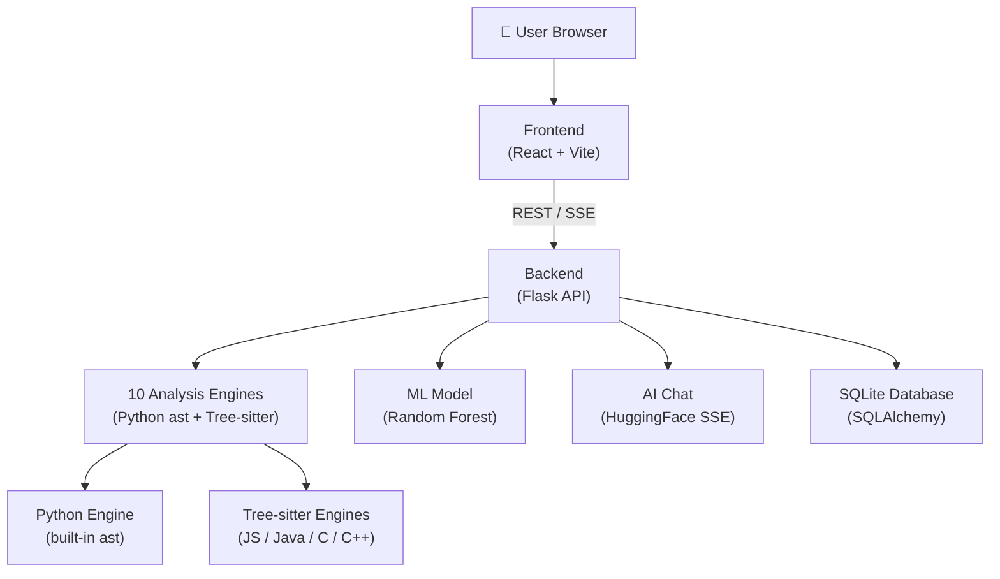

# ASTra — Complete Project Explainer

## What Is ASTra?

**ASTra** (AST-Native Code Intelligence) is a **static code analysis platform** — it reads your source code without running it and tells you:

- How fast it is (time complexity: O(n), O(n²), etc.)
- How much memory it uses (space complexity)
- Where inefficiencies, bugs, and bad patterns hide
- How complex it is to test (cyclomatic complexity)
- How "clean" it is (Halstead software science metrics)
- Whether you have dead code, type mismatches, anti-patterns

Think of it as a smarter, deeper version of ESLint or Pylint — but completely **built from scratch** using Python's `ast` module (no linter libraries borrowed). It also layers on an AI chat assistant and a machine-learning quality predictor.

---

## How It Is Built — The Full Stack

### Layer 1 — Frontend: React + Vite

Built with **React 18** and bundled with **Vite**. No UI framework — custom CSS with glassmorphism aesthetics.

| Component | What it does |
|-----------|-------------|
| `LandingPage.jsx` | Hero page, engine showcase, calls-to-action |
| `CodeEditor.jsx` | Syntax-highlighted editor (Prism.js) |
| `AnalysisBoard.jsx` | Main results panel: complexity, cyclomatic, confidence bars, findings cards |
| `CFGVisualizer.jsx` | SVG control-flow graph with pan/zoom and colored edges |
| `Chat.jsx` | Context-aware AI chat via SSE streaming |
| `FixPanel.jsx` | "Fix it for me" — rewrites code via AI |
| `HistoryPanel.jsx` | Quality score timeline for authenticated users |
| `TrendVisualiser.jsx` | Complexity trends across analysis history |
| `DiffAnalyzer.jsx` | Side-by-side code diff with complexity comparison |
| `ChallengeMode.jsx` | Algorithmic challenge grader |
| `AuthModal.jsx` | Register / login UI |

### Layer 2 — Backend: Flask REST API

`app.py` is the single entrypoint. It wires together all 10 engines per request and enforces security.

**Key middleware stack:**
- **Flask-Talisman** → CSP, HSTS, X-Frame-Options headers
- **Flask-CORS** → strict origin whitelist (localhost:5173, localhost:80, Vercel)
- **Flask-Limiter** → 200/day global; 30/min on `/analyze`
- **Flask-JWT-Extended** → 7-day tokens, bcrypt passwords

### Layer 3 — Analysis Engines

10 hand-written engines (described below). Python code uses Python's built-in `ast` module. Non-Python languages use **Tree-sitter** parsers.

### Layer 4 — ML Model

A **Random Forest Classifier** with `StandardScaler` pipeline, trained on the Google MBPP dataset. Predicts whether code is "efficient" or not based on 5 extracted features.

### Layer 5 — Database: SQLite + SQLAlchemy

Two tables: `users` (bcrypt passwords, JWT identity) and `analyses` (history, quality score, hashes). Analysis records are deduplicated via SHA-256 hash of the code.

---

## The 10 Analysis Engines

These are the heart of ASTra. Every engine operates on the **Abstract Syntax Tree** — the parsed, structured tree representation of source code.

### Engine 1 — InferenceEngine (`inference_engine.py`)
Infers **time AND space complexity** from loop structure alone.

| What it detects | How |
|----------------|-----|
| `for i in range(10)` | Constant → **O(1)** |
| `for i in range(n)` | Variable → **O(n)** |
| Nested `for` loops | Multiply depths → **O(n²)**, **O(n³)** |
| `while i //= 2` | Multiplicative step → **O(log n)** |
| `while i += 1` | Linear step → **O(n)** |
| List append inside loop | Space grows → **O(n) space** |
| List comprehension over variable | → **O(n) space** |

The engine uses `_combine_nested()` to multiply complexities when loops are nested: `O(n) × O(n) = O(n²)`, `O(n) × O(log n) = O(n log n)`.

### Engine 2 — RecursionClassifier (`recursion_classifier.py`)
Classifies 6 recursion patterns and assigns a complexity hint:

| Pattern | Example | Hint |
|---------|---------|------|
| `linear` | `f(n-1)` | O(n) |
| `binary` | `f(n//2)` | O(log n) |
| `divide_conquer` | 2 calls to `f(n//2)` | O(n log n) |
| `tail_recursive` | last line is the call | O(n) but optimizable |
| `memoized` | `@lru_cache` or `@cache` | O(n) |
| `mutual` | `f()` calls `g()`, `g()` calls `f()` | O(2^n) worst case |

### Engine 3 — ExplanationBuilder (`explanation_builder.py`)
Generates **plain-English explanations** using your actual variable names and line numbers. Fully deterministic — no LLM involved.

Example output: *"The outer loop on line 3 iterates over `nums` (O(n)). The inner loop on line 5 also iterates over `nums` (O(n)). Combined nesting gives O(n²) time complexity."*

### Engine 4 — DataFlowTracer (`data_flow_tracer.py`)
Detects **5 data-flow inefficiency patterns**:

1. **List membership check** (`x in list`) that should be a set — O(n) vs O(1) lookup
2. **String concatenation in a loop** → quadratic due to immutability
3. **Repeated `len()` calls** inside a loop body
4. **Sort-then-index pattern** → could use `min()`/`max()` directly
5. **Nested list comprehensions** → potential O(n²) memory allocation

Uses `TypeInferencer` (Engine 9) to know the type of each variable before flagging.

### Engine 5 — AntiPatternDetector (`anti_pattern_detector.py`)
Catches **5 classic Python anti-patterns**:

1. **Mutable default arguments** — `def f(x=[])` is a shared bug
2. **Bare `except:` clauses** — swallows all exceptions silently
3. **Global variable modifications** inside functions
4. **Unguarded `return` inside a loop** — often a logic error
5. **Redundant constant assignments** — assigning the same literal repeatedly

### Engine 6 — CyclomaticAnalyzer (`cyclomatic_analyzer.py`)
Implements **McCabe's 1976 formula**: counts decision points (if/elif/for/while/except/and/or) and adds 1.

| Score | Risk Label |
|-------|-----------|
| 1–4 | Simple |
| 5–7 | Moderate |
| 8–10 | Complex |
| 11–15 | High |
| 16+ | Untestable |

Returns per-function breakdowns.

### Engine 7 — ConfidenceEstimator (`confidence_estimator.py`)
Adds **honest uncertainty bounds** to every complexity estimate.

- Confidence drops when loop bounds are function calls (e.g., `range(f(x))`)
- Suggests alternatives when confidence < 0.85
- Outputs a confidence percentage alongside each estimate

### Engine 8 — DeadCodeDetector (`dead_code_detector.py`)
Detects **5 dead code patterns**:

1. **Unused variables** — assigned but never read
2. **Unused imports** — imported but never referenced
3. **Unreachable code after `return`** or `raise`
4. **Functions defined but never called**
5. **Unreachable branches** (e.g., `if False:`)

### Engine 9 — TypeInferencer (`type_inferencer.py`)
Infers variable types **statically without running the code**:
- `x = []` → `list`
- `x = {}` → `dict`
- `x = "hello"` → `str`
- `x = 0` → `int`

Feeds into DataFlowTracer so it can distinguish a set from a list for O(1) vs O(n) lookup.

### Engine 10 — HalsteadAnalyzer (`halstead_analyzer.py`)
Implements **Halstead's 1977 software science metrics**:

| Metric | What it measures |
|--------|-----------------|
| Vocabulary (η) | Unique operators + operands |
| Volume (V) | N × log₂(η) — size of implementation |
| Difficulty (D) | Effort to write/understand |
| Effort (E) | D × V |
| Bugs Estimated (B) | V / 3000 — predicted defect count |

### Supporting Modules

| Module | Purpose |
|--------|---------|
| `CFGBuilder` | Builds a Control Flow Graph (nodes + typed edges) for Python |
| `ReportBuilder` | Generates ASCII-formatted downloadable analysis reports |
| `EcoScore` | Estimates carbon footprint based on complexity + language |
| `FunctionSplitter` | Splits code into per-function chunks for individual analysis |
| `LanguageDetector` | Weighted heuristic scoring to auto-detect language |

---

## Language Support — Feature Matrix

| Feature | Python | JavaScript | Java | C | C++ |
|---------|--------|-----------|------|---|-----|
| **Parser** | Built-in `ast` | Tree-sitter | Tree-sitter | Tree-sitter | Tree-sitter |
| **Time complexity** | ✅ Full | ✅ Full | ✅ Full | ✅ Full | ✅ Full |
| **Space complexity** | ✅ Full | ✅ Full | ✅ Full | ✅ Full | ✅ Full |
| **Recursion detection** | ✅ 6 patterns | ✅ Yes | ✅ Yes | ✅ Yes | ✅ Yes |
| **Nested loop depth** | ✅ Yes | ✅ Yes | ✅ Yes | ✅ Yes | ✅ Yes |
| **Binary search detection** | ✅ (mul while) | ✅ (`mid`/`>>1`) | ✅ (`mid`/`>>1`) | ✅ (`mid`/`>>1`) | ✅ (`lower_bound`) |
| **Sorting detection** | ✅ Yes | ✅ `.sort()`, `.toSorted()` | ✅ `Arrays.sort()` | ✅ `qsort()` | ✅ `std::sort()` |
| **Dynamic programming** | ✅ (`dp`, `memo` vars) | ✅ | ✅ | ✅ | ✅ |
| **Higher-order functions** | ✅ comprehensions | ✅ `.map()`, `.filter()` etc | — | — | ✅ `std::for_each()` |
| **Cyclomatic complexity** | ✅ Per function | ❌ | ❌ | ❌ | ❌ |
| **Confidence intervals** | ✅ Yes | ❌ | ❌ | ❌ | ❌ |
| **Dead code detection** | ✅ 5 patterns | ❌ | ❌ | ❌ | ❌ |
| **Type inference** | ✅ Static | ❌ | ❌ | ❌ | ❌ |
| **Halstead metrics** | ✅ Full | ❌ | ❌ | ❌ | ❌ |
| **Data flow tracing** | ✅ 5 patterns | ❌ | ❌ | ❌ | ❌ |
| **Anti-pattern detection** | ✅ 5 patterns | ❌ | ❌ | ❌ | ❌ |
| **Plain-English explanation** | ✅ Yes | ❌ | ❌ | ❌ | ❌ |
| **Per-function breakdown** | ✅ Yes | ❌ | ✅ Yes | ❌ | ❌ |
| **CFG visualization** | ✅ Yes | ❌ | ❌ | ❌ | ❌ |
| **STL container awareness** | N/A | N/A | N/A | N/A | ✅ Yes |
| **Template function support** | N/A | N/A | N/A | N/A | ✅ Yes |
| **Lambda / arrow functions** | ✅ Yes | ✅ Arrow fns | ✅ Lambdas | ❌ | ✅ Lambdas |
| **Enhanced for loops** | ✅ Yes | ✅ `for-of/in` | ✅ `for (x: arr)` | ❌ | ✅ range-based |
| **Map/Set O(1) detection** | ✅ (via type info) | ✅ Map/Set | ✅ HashMap | ❌ | ✅ unordered_map |

> [!NOTE]
> Python has the deepest analysis because it uses Python's own `ast` module — every node has full semantic context. The other four languages use Tree-sitter which provides structural parsing but less semantic depth.

---

## Per-Language Deep Dive

### Python — Full Analysis (10 engines)

Python is the first-class citizen. When you submit Python code:

1. **`parse_code()`** → parses into a Python `ast.Module`
2. **InferenceEngine** → walks all `For`/`While` nodes, classifies each, nests them
3. **RecursionClassifier** → identifies the recursion pattern (linear, binary, etc.)
4. **ExplanationBuilder** → produces a human sentence referencing your actual variables
5. **CyclomaticAnalyzer** → counts decision points per function
6. **ConfidenceEstimator** → adds uncertainty percentage
7. **DeadCodeDetector** → finds unused imports, unreachable lines, etc.
8. **TypeInferencer** → infers types statically
9. **DataFlowTracer** → uses type info to flag O(n) lookups, string concat in loops, etc.
10. **AntiPatternDetector** → flags mutable defaults, bare excepts, etc.
11. **HalsteadAnalyzer** → computes vocabulary, volume, difficulty, bug estimate
12. **CFGBuilder** → builds a control flow graph (for `/cfg` endpoint)
13. **FunctionSplitter** → per-function complexity breakdown

### JavaScript — Tree-sitter (Full complexity)

`js_analyzer.py` uses `tree_sitter_javascript`. Supports:
- ES5, ES6+, TypeScript-flavored syntax
- Arrow functions (`a => b`, `(a, b) => { ... }`)
- `const`/`let`/`var`
- `for-of`, `for-in`, `do-while`
- Higher-order methods: `.forEach()`, `.map()`, `.filter()`, `.reduce()`, `.flatMap()`, etc. (11 methods)
- `.sort()` / `.toSorted()` → O(n log n)
- Binary search detection via `mid`/`>>1` in while loop body text
- `new Array()`, `new Map()`, `new Set()` → O(n) space
- DP pattern: variable names containing `dp`/`memo`/`cache`

### Java — Tree-sitter (Full complexity + function breakdown)

`java_analyzer.py` uses `tree_sitter_java`. Accepts any snippet (bare method, inner class, full class, LeetCode-style). Supports:
- `for`, enhanced-for (`for (int x : arr)`), `while`, `do-while`, labeled statements
- `Arrays.sort()`, `Collections.sort()`, `parallelSort()` → O(n log n)
- `binarySearch()` → O(log n)
- HashMap/HashSet operations: `.put()`, `.get()`, `.contains()` → O(n) space
- `new int[n]` array allocation → O(n) space
- `int[][] dp = new int[m][n]` → O(n²) space
- **Per-method function breakdown** (unique among non-Python languages)

### C — Tree-sitter (Full complexity)

`c_analyzer.py` uses `tree_sitter_c`. Supports:
- `for`, `while`, `do-while`
- `qsort()` → O(n log n)
- `malloc()`/`calloc()`/`realloc()` → O(n) space
- `bsearch()` → O(log n)
- Recursion detection
- Pointer/array allocation patterns

### C++ — Tree-sitter (Full complexity + STL awareness)

`cpp_analyzer.py` uses `tree_sitter_cpp`. The most feature-rich non-Python analyzer:

**Language features:**
- C++11/14/17/20 syntax
- Range-based `for (auto x : v)`
- Lambda expressions `[&](int x){ ... }`
- Template functions and class methods

**STL awareness:**
| STL | Detected as |
|-----|-------------|
| `std::sort()`, `stable_sort()`, `partial_sort()` | O(n log n) |
| `std::binary_search()`, `lower_bound()`, `upper_bound()` | O(log n) |
| `std::for_each()`, `std::transform()`, `std::accumulate()` | +1 loop depth |
| `vector`, `string`, `deque`, `list`, `queue`, `stack` | O(n) space |
| `map<>`, `set<>`, `unordered_map`, `unordered_set` | O(n) space |
| `new int[n]`, `malloc()` | O(n) space |
| `int dp[m][n]` or variable named `dp`/`memo` | O(n²) space |

Qualified names like `std::sort` are resolved to their base (`sort`) before classification.

---

## API Endpoints

| Method | Endpoint | Auth | Rate Limit | What it returns |
|--------|----------|------|-----------|----------------|
| GET | `/` | None | — | Health text |
| GET | `/health` | None | — | `{status, model_loaded}` |
| POST | `/analyze` | Optional JWT | 30/min | Full analysis JSON |
| POST | `/cfg` | None | 20/min | Control flow graph |
| POST | `/report` | None | 10/min | Plain-text download |
| POST | `/chat` | None | — | SSE stream |
| GET | `/chat/models` | None | — | HuggingFace model list |
| GET | `/history` | JWT required | — | Last 50 analyses |
| POST | `/auth/register` | None | — | JWT token |
| POST | `/auth/login` | None | — | JWT token |
| GET | `/auth/me` | JWT required | — | User info |
| GET | `/challenges` | None | — | Challenge list |
| POST | `/challenges/<id>/submit` | None | 20/min | Grading result |

---

## ML Model

| Property | Value |
|----------|-------|
| Algorithm | Random Forest Classifier + StandardScaler |
| Training data | Google MBPP (real human-written Python) |
| Label proxy | Test pass/fail as efficiency proxy |
| Input features | `loop_depth`, `is_recursive`, `uses_extra_memory`, `time_penalty`, `space_penalty` |
| Output | Binary: efficient (0) / inefficient (1) |
| Stored as | `model/code_quality_model.pkl` |

> [!WARNING]
> The ML label proxy means: a correct-but-slow O(n²) solution scores as "efficient" (0), while a buggy O(n) solution scores as "inefficient" (1). The model measures correctness, not true algorithmic efficiency.

---

## Security Model

| Layer | Mechanism |
|-------|----------|
| Auth | JWT (7-day expiry), bcrypt password hashing |
| Headers | flask-talisman: CSP, HSTS, X-Frame-Options, X-Content-Type-Options |
| Rate limiting | 200/day, 50/hour global; 30/min on `/analyze` |
| CORS | Strict origin whitelist (no wildcard) |
| Input size | Max 10,000 chars per code submission |
| Error handling | Global exception handler — no stack traces leaked |
| XSS | DOMPurify on all AI-generated markdown in frontend |
| Secrets | All via environment variables, never hardcoded |

---

## Known Limitations

1. **Binary search via `lo/hi` convergence** is not detected in Python (only multiplicative while-loop steps are). This requires abstract interpretation — a research-level problem.
2. **ML labels are correctness proxies**, not true efficiency labels.
3. **`exec()` in dataset fetcher** (`fetch_real_dataset.py`) should only run in trusted environments. SIGALRM timeout doesn't work on Windows.
4. **Language detection** uses weighted heuristics — may misclassify very short or ambiguous snippets.
5. **Deep analysis features** (Halstead, dead code, type inference, cyclomatic, CFG) are **Python-only**.
